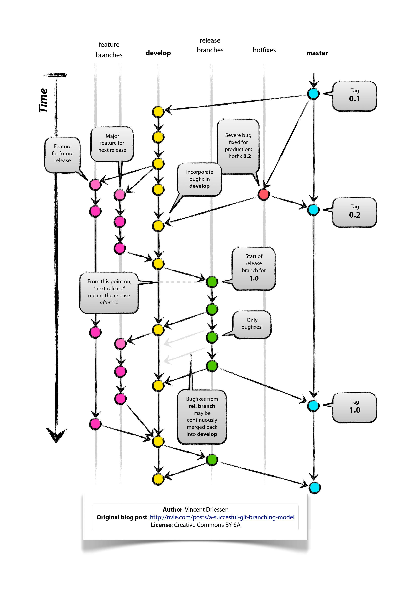

# GitFlow y GitHub

- Fuente: [A successful Git branching model: Vincent Driessen](https://nvie.com/posts/a-successful-git-branching-model/)
- Fuente: [GitFlow en Github: G. Mizael Mtz Hdzn (youtube)](https://www.youtube.com/watch?v=LkYWop93S70&t=2176s)

## ¿Qué es GitFlow?

GitFlow se define como un sistema de branching o `ramificación o modelo de manejo de ramas en Git`, en el que se usan las `ramas principales y auxiliares`. 

### Ramas principales

Son ramas fijas, con tiempo de vida infinito.

- `main`, esta rama contiene el código estable del producto. Representa la versión en producción.
- `develop`, contiene los últimos cambios desarrollados para la próxima versión del software.

Si trabajamos con plataformas en la nube como `GitHub` u otro que nos ofrecen el servicio de alojamiento y gestión de repositorios de código, veremos que cuando clonamos un proyecto tendremos como rama remota `origin/main` y su equivalente en nuestro local `main`. Lo mismo sucede cuando creamos una rama en local llamada `develop`, su equivalente en el repositorio remoto sería `origin/develop`.

Consideramos que `origin/main` **es la rama principal donde el código fuente de HEAD siempre refleja un estado listo para producción.**

Consideramos que `origen/develop` **es la rama principal donde el código fuente de HEAD siempre refleja un estado con los últimos cambios de desarrollo entregados para la próxima versión.**

### Ramas auxiliares

Además de las ramas principales de `main y develop`, nuestro modelo de desarrollo utiliza una **variedad de ramas de soporte para ayudar al desarrollo paralelo entre los miembros del equipo, facilitar el seguimiento de las funciones, prepararse para los lanzamientos de producción y ayudar a solucionar rápidamente los problemas de producción en vivo.** A diferencia de las ramas principales, estas ramas siempre tienen un tiempo de vida limitado, ya que eventualmente serán eliminadas.

Cada una de estas ramas tiene un propósito específico y **está sujeta a reglas estrictas sobre qué ramas pueden ser su ramas de origen y qué ramas deben ser sus objetivos de fusión.**

- `feature`, contendrá un desarrollo o evolutivo. Cada nueva mejora o característica que vayamos introduciendo en nuestro software tendrá una rama que contendrá su desarrollo.
- `release`, cuando **se está preparando una nueva versión para ser lanzada**, se crea una rama de "release" a partir de "develop". Aquí se realizan los últimos ajustes, pruebas y preparativos para el lanzamiento.
- `hotfix`, las ramas hotfix también están destinadas a prepararse para una nueva versión de producción, aunque no esté planificada. **Surgen de la necesidad de actuar inmediatamente ante un estado no deseado de una versión de producción en vivo.** Cuando un **error crítico en una versión de producción debe resolverse inmediatamente.**

Es importante aclarar que inicialmente `Git` tenía como nombre de rama principal `master` pero posteriormente se cambió al nombre de `main`, en ese sentido, se muestra a continuación las interacciones entre las distintas ramas de GitFlow:

## Origen y destino de las ramificaciones

| Rama          | Origen   | Destino          | Convención  | Ejemplo                       |
|---------------|----------|------------------|-------------|-------------------------------|
| **main**      |          |                  |             |                               |
| **develop**   | main     |                  |             |                               |
| **feature**   | develop  | develop          | feature/    | feature/nombre-de-feature     |
| **release**   | develop  | develop y main   | release-*   | release-1.2                   |
| **hotfix**    | main     | develop y main   | hotfix-*    | hotfix-1.2.1

