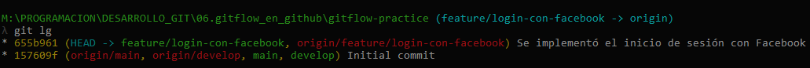
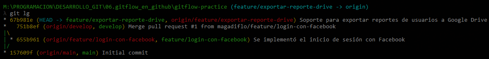

# GitFlow y GitHub

- Fuente: [A successful Git branching model: Vincent Driessen](https://nvie.com/posts/a-successful-git-branching-model/)
- Fuente: [GitFlow en Github: G. Mizael Mtz Hdzn (youtube)](https://www.youtube.com/watch?v=LkYWop93S70&t=2176s)

## ¿Qué es GitFlow?

GitFlow se define como un sistema de branching o `ramificación o modelo de manejo de ramas en Git`, en el que se usan las `ramas principales y auxiliares`. 

### Ramas principales

Son ramas fijas, con tiempo de vida infinito.

- `main`, esta rama contiene el código estable del producto. Representa la versión en producción.
- `develop`, contiene los últimos cambios desarrollados para la próxima versión del software.

Si trabajamos con plataformas en la nube como `GitHub` u otro que nos ofrecen el servicio de alojamiento y gestión de repositorios de código, veremos que cuando clonamos un proyecto tendremos como rama remota `origin/main` y su equivalente en nuestro local `main`. Lo mismo sucede cuando creamos una rama en local llamada `develop`, su equivalente en el repositorio remoto sería `origin/develop`.

Consideramos que `origin/main` **es la rama principal donde el código fuente de HEAD siempre refleja un estado listo para producción.**

Consideramos que `origen/develop` **es la rama principal donde el código fuente de HEAD siempre refleja un estado con los últimos cambios de desarrollo entregados para la próxima versión.**


### Ramas auxiliares

Además de las ramas principales de `main y develop`, nuestro modelo de desarrollo utiliza una **variedad de ramas de soporte para ayudar al desarrollo paralelo entre los miembros del equipo, facilitar el seguimiento de las funciones, prepararse para los lanzamientos de producción y ayudar a solucionar rápidamente los problemas de producción en vivo.** A diferencia de las ramas principales, estas ramas siempre tienen un tiempo de vida limitado, ya que eventualmente serán eliminadas.

Cada una de estas ramas tiene un propósito específico y **está sujeta a reglas estrictas sobre qué ramas pueden ser su ramas de origen y qué ramas deben ser sus objetivos de fusión.**

- `feature`, contendrá un desarrollo o evolutivo. Cada nueva mejora o característica que vayamos introduciendo en nuestro software tendrá una rama que contendrá su desarrollo.
- `release`, cuando **se está preparando una nueva versión para ser lanzada**, se crea una rama de "release" a partir de "develop". Aquí se realizan los últimos ajustes, pruebas y preparativos para el lanzamiento.
- `hotfix`, las ramas hotfix también están destinadas a prepararse para una nueva versión de producción, aunque no esté planificada. **Surgen de la necesidad de actuar inmediatamente ante un estado no deseado de una versión de producción en vivo.** Cuando un **error crítico en una versión de producción debe resolverse inmediatamente.**

Es importante aclarar que inicialmente `Git` tenía como nombre de rama principal `master` pero posteriormente se cambió al nombre de `main`, en ese sentido, se muestra a continuación las interacciones entre las distintas ramas de GitFlow:


## Origen y destino de las ramificaciones

| Rama          | Origen   | Destino          | Convención  | Ejemplo                       |
|---------------|----------|------------------|-------------|-------------------------------|
| **main**      |          |                  |             |                               |
| **develop**   | main     |                  |             |                               |
| **feature**   | develop  | develop          | feature/    | feature/nombre-de-feature     |
| **release**   | develop  | main y develop   | release-*   | release-1.2                   |
| **hotfix**    | main     | main y develop   | hotfix-*    | hotfix-1.2.1                  |

## Práctica: Tabla de cambios

|ID         |  DESCRIPCIÓN CORTA                            |  RAMA DE TRABAJO                | RAMA ORIGEN | RAMA DESTINO   |
|-----------|-----------------------------------------------|---------------------------------|-------------|----------------|
|Cambio #1  |  Implementar inicio de sesión con facebook    |  feature/login-con-facebook     | develop     | develop        |
|Cambio #2  |  Exportar reporte de usuarios a Google Drive  |  feature/exportar-reporte-drive | develop     | develop        |
|Cambio #3  |  Error al iniciar sesión con Linkedin (1.1.0) |  hotfix-1.1.0                   | main        | main y develop |
|Cambio #4  |  Liberar versión (1.2.0)                      |  release-1.2.0                  | develop     | main y develop |

## Inicio: Creación de repositorio

- En `GitHub` creamos un repositorio llamado `gitflow-practice`. Por defecto, cuando creamos un repositorio se crea la rama `main`.
- Clonamos el `repositorio remoto` en nuestra pc para tenerlo como `repositorio local`.
- En nuestro `repositorio local, creamos la rama develop` y nos posicionamos en él.
    ````bash
    git checkout -b develop
    ````
- Subimos la rama `develop` a `GitHub`.
    ````bash
    git push -u origin develop
    ````

- Hasta este punto, tenemos nuestro repositorio local y remoto de esta manera:
    ````bash
    M:\PROGRAMACION\DESARROLLO_GIT\06.gitflow_en_github\gitflow-practice (develop -> origin)
    λ git lg
    * 530cdd2 (HEAD -> develop, origin/main, origin/develop, origin/HEAD, main) Initial commit
    ````
- A partir de aquí, ya **estamos listos para empezar a generar nuevas features.**

## Cambio #1: feature/login-con-facebook

### Funcionalidad
- Nos posicionamos en la rama `develop` y lo actualizamos con cambios que hayan en la `rama remota develop`.
    ````bash
    git checkout develop | git pull origin develop | revisar git graph
    ````
- Creamos la rama del feature y **nos posicionamos en él:**
    ````bash
    git checkout -b feature/login-con-facebook
    ````
- **Implementamos el feature:** creación de archivos, vistas, codificación, etc.. relacionado al feature.
  En nuestro caso solo creamos archivos representativos, donde suponemos está nuestra implementación del login.
    ````bash
    touch login-facebook.html login-facebook.css login-facebook.js
    ````
- Agregamos los archivos implementados al `staging area`:
    ````bash
    git add .
    ````
- Confirmamos los cambios con un commit, agregándolos al `git repository`:
    ````bash
    git commit -m "Se implementó el inicio de sesión con Facebook"
    ````
- Posicionados en nuestra rama `feature/login-con-facebok` lo pusheamos para que esté en `GitHub`:
    ````bash
    git push -u origin feature/login-con-facebook
    ````
### Resultado

- **Repositorio Local**

    

- **Repositorio Remoto**

    

### Pull Request

**Realizamos un pull request** para que **la rama trabajada**, que fue subida al repositorio remoto, **se integre a la rama develop del repositorio remoto.**


Hasta este momento no hemos integrado las ramas, sino que solo hicimos la solicitud `(pull request)` **para que nuestra rama feature/login-con-facebook sea integrada a la rama develop.**
Veremos además, que luego de haber realizado el pull request se creó un ícono que dice "Open" en color verde, y está a la espera de que se haga la confirmación.


### Aprobando Pull Request

Debemos avisar a quien tenga permiso de aprobar los Pull Request que revise nuestro pull request subido y nos lo apruebe en caso de que esté todo correcto.
Lo que haría el encargado de aprobar los pull request sería `ir a la pestaña Pull requests del repositorio remoto en GitHub`. Abrir nuestro pull request, `verificar los cambios que se han hecho (pestaña commits)`, ver los archivos modificados, en caso sea necesario, llevar esos cambios a su local, hace pruebas, etc.. 

**Una vez verificado que nuestro pull request está correcto**, iría a la pestaña Conversation y haría click en `Merge pull request`


Ahora, si damos click nuevamente en la pestaña `Pull requests` (como en el paso 1) veremos que **ya no tendremos ningún pull request pendiente.**

## Cambio #2: feature/exportar-reporte-drive

Como ya vimos la secuencia del Cambio #1, este nuevo cambio será algo similar:

### Funcionalidad
````bash
git checkout develop | git pull origin develop | revisar git graph
````
````bash
git checkout -b feature/exportar-reporte-drive
````
````bash
touch exportar-reporte-drive.xls
````
````bash
git add .
````
````bash
git commit -m "Soporte para exportar reportes de usuarios a Google Drive"
````
````bash
git push -u origin feature/exportar-reporte-drive
````

### Resultado
- **Repositorio Local**

    

- **Repositorio Remoto**

    

### Pull Request

Solicitaremos que nuestra rama `feature/exportar-reporte-drive sea integrado a la rama develop`.
Para eso realizamos la misma secuencia que seguimos en el `Cambio #1` en nuestro `repositorio remoto de GitHub`:

> **Repositorio > Pull requests > new pull request**
> - **base:** develop
> - **compare:** feature/exportar-reporte-drive


### Aprobando Pull Request

Aquí se haría la aprobación del pull request como en el `Cambio #1`.

---

**¡IMPORTANTE!**

> Antes de que cree una nueva rama, a partir de, por ejemplo: la rama Develop, **es importante ACTUALIZAR nuestro repositorio local con lo que se tenga en el REPOSITORIO REMOTO (git pull)**, tal como lo hicimos en el Cambio #1 y Cambio #2 al inicio de los pasos a implementar.

Hasta este punto, teniendo actualizado nuestra rama `develop` de nuestro `repositorio local` con los cambios ocurridos en el repositorio remoto, tenemos nuestras ramas de esta manera:


---

